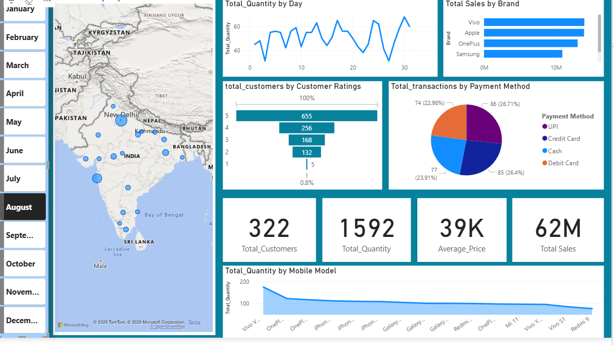

## 📊 Mobile Sales Dashboard – India

This Power BI project visualizes mobile phone sales across India, highlighting customer behavior, brand performance, and payment preferences. The dataset was cleaned and transformed using Power Query before being loaded into Power BI for interactive analysis.

### 🔧 ETL & Data Preparation (Power Query)

- Combined three separate date columns by:
  - Converting numeric values to string
  - Merging into a single column
  - Recasting to proper date format
- Removed a column with irregular day names and extracted valid day names from the cleaned date column
- Ensured **100% data quality** before loading into Power BI

### 🎨 Power BI Enhancements

- Inserted a **month slicer** for dynamic filtering
- Customized **canvas background** for improved visual appeal
- Built interactive visuals including:
  - Sales distribution map across India
  - Brand-wise sales comparison
  - Customer rating breakdown
  - Payment method analysis
  - Daily quantity trends and model-wise performance

### 📈 Key Metrics Displayed

- Total Customers
- Total Quantity Sold
- Average Price
- Total Sales

## 
